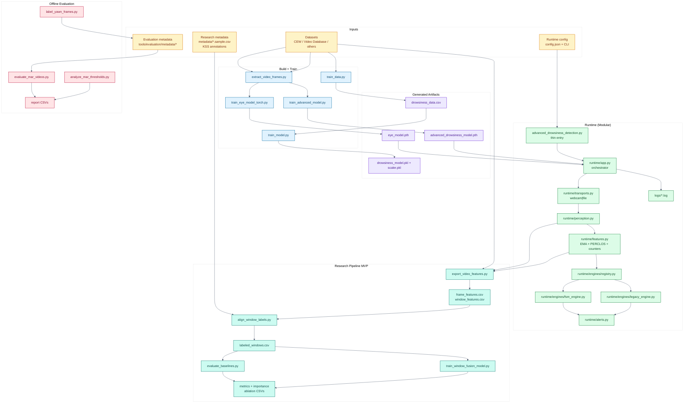
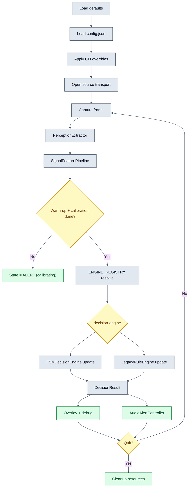
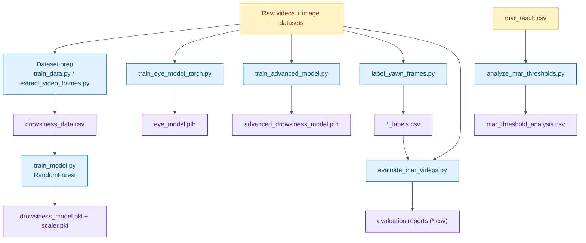
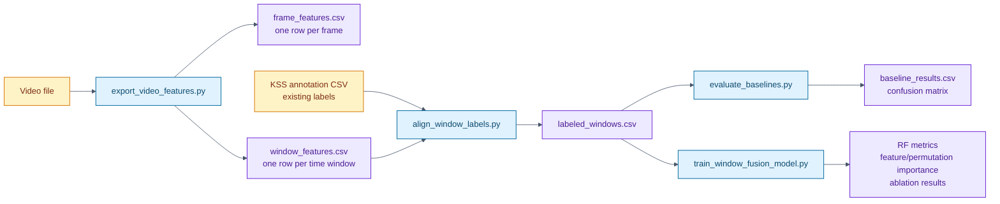

# Codebase Visual Map

This page gives a high-level visual of the current modular repository structure and the main data/model flows.

## 1) System Map (Modular)

## 2) Advanced Runtime Flow (`runtime/app.py`)

## 3) Training + Evaluation Pipeline

## 4) Research Pipeline MVP

KSS labels are not generated by the exporter. They must come from an annotation file or a public/validated dataset before metrics can be reported as real research evidence.

## 5) Quick Orientation

- Real-time modular runtime: start with `advanced_drowsiness_detection.py` and `runtime/app.py`.
- Engine selection: use `--decision-engine fsm|legacy`.
- Config path + overrides: use `--config` plus CLI overrides.
- Baseline model runtime: `drowsiness_detection_with_model.py`.
- Offline evaluation workflows: tools under `tools/evaluation/`.
- Research pipeline workflows: tools under `tools/research/`, sample fixtures under `metadata/`, generated reports under `reports/research/`.
- DA1/bundle provenance: docs under `docs/merge/`.
