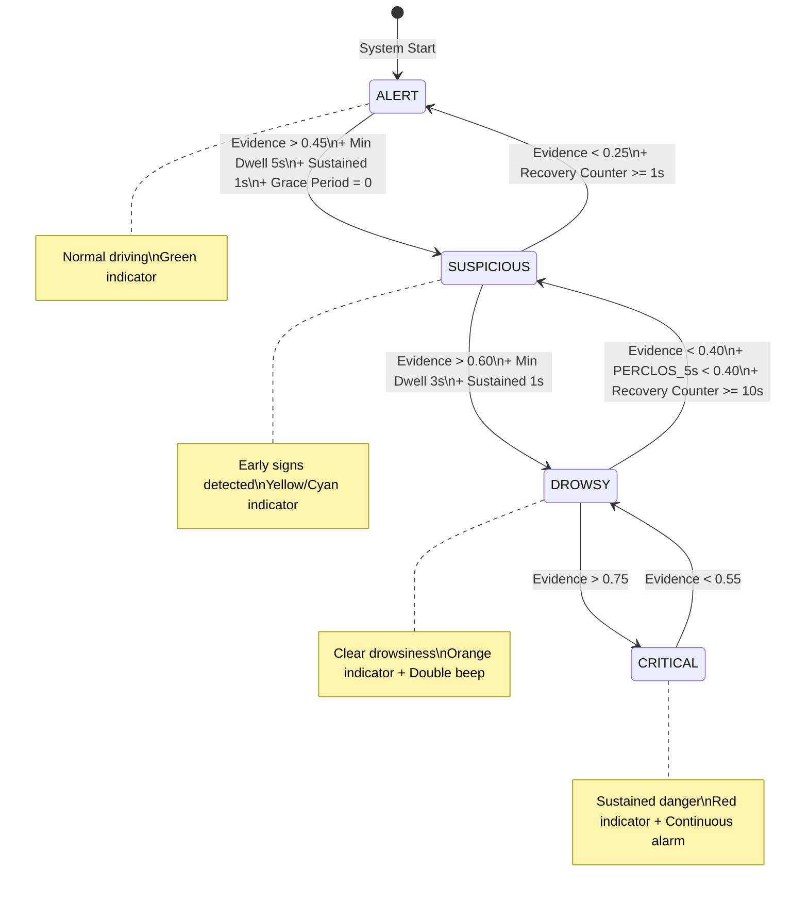
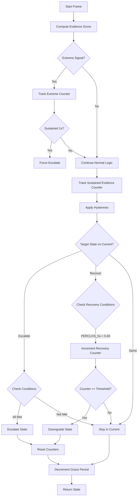

# FSM State Transitions - Drowsiness Detection System

## Overview

The Finite State Machine (FSM) implements a **4-state model** with **hysteresis** to prevent state oscillation when signals hover near thresholds. This is based on thesis §5.3-5.4.

---

## State Diagram



---

## The Four States

| State | Vietnamese | Description | Alert |
|-------|------------|-------------|-------|
| `ALERT` | TỈNH TÁO | Driver is awake, normal driving | None (Green) |
| `SUSPICIOUS` | NGHI NGỜ | Early drowsiness signs detected | Visual only (Yellow/Cyan) |
| `DROWSY` | BUỒN NGỦ | Clear drowsiness confirmed | Double beep (Orange) |
| `CRITICAL` | NGUY KỊCH | Sustained danger, immediate action needed | Continuous alarm (Red) |

---

## Evidence Score Calculation

The FSM computes a normalized evidence score `[0, 1]` from multiple signals:

### Weight Distribution

| Signal | Weight | Condition |
|--------|--------|-----------|
| **Eye Closure (EAR)** | 40% | EAR below threshold + consecutive frames bonus |
| **PERCLOS** | 25% | Cumulative eye closure over 60s |
| **Head Nodding** | 15% | Pitch angle + velocity (>5°/frame) |
| **Yawning** | 10% | MAR above threshold or 3+ yawns |
| **Gaze/Blink Anomalies** | 10% | Fixed gaze (tunnel vision) or rapid blinking |

### Evidence Formula (from `fsm.py:L151-204`)

```python
def _compute_evidence(self, signals: DrowsinessSignals) -> float:
    score = 0.0
    
    # 1. Eye closure evidence (40%)
    if signals.ear_below_threshold:
        score += 0.2
        if signals.eyes_closed_consecutive > self.frames_to_suspicious:
            score += 0.2  # Bonus for sustained closure
    
    # 2. PERCLOS evidence (25%)
    if signals.perclos > self.perclos_threshold:
        perclos_evidence = min(
            (signals.perclos - self.perclos_threshold) / (0.5 - self.perclos_threshold),
            1.0
        )
        score += perclos_evidence * 0.25
    
    # 3. Head nodding evidence (15%)
    if signals.head_nod_detected:
        score += 0.10
    if abs(signals.pitch_velocity) > 5.0:
        score += 0.05
    
    # 4. Yawning evidence (10%)
    if signals.yawn_frequency >= 3:
        score += 0.10
    elif signals.mar_above_threshold:
        score += 0.05
    
    # 5. Gaze / blink anomalies (10%)
    if signals.gaze_stable:  # Fixed gaze = tunnel vision
        score += 0.10
    elif signals.blink_frequency > 10:
        score += 0.05
    
    return min(score, 1.0)
```

---

## Hysteresis Thresholds

Hysteresis uses **different thresholds for entering vs. leaving** each state to prevent oscillation:

### Threshold Table

| Current State | Escalate (τ_high) | Recover (τ_low) | Target State |
|---------------|-------------------|-----------------|--------------|
| ALERT | Evidence > 0.45 | - | → SUSPICIOUS |
| SUSPICIOUS | Evidence > 0.60 | Evidence < 0.25 | → DROWSY / ← ALERT |
| DROWSY | Evidence > 0.75 | Evidence < 0.40 | → CRITICAL / ← SUSPICIOUS |
| CRITICAL | - | Evidence < 0.55 | ← DROWSY |

### Hysteresis Logic (from `fsm.py:L254-281`)

```python
def _apply_hysteresis(self, evidence: float) -> DrowsinessState:
    current = self.state
    
    if current == DrowsinessState.ALERT:
        if evidence > 0.45:  # τ_high — harder to escalate
            return DrowsinessState.SUSPICIOUS
    
    elif current == DrowsinessState.SUSPICIOUS:
        if evidence > 0.60:  # τ_high
            return DrowsinessState.DROWSY
        elif evidence < 0.25:  # τ_low — easier to recover
            return DrowsinessState.ALERT
    
    elif current == DrowsinessState.DROWSY:
        if evidence > 0.75:  # τ_high
            return DrowsinessState.CRITICAL
        elif evidence < 0.40:  # τ_low
            return DrowsinessState.SUSPICIOUS
    
    elif current == DrowsinessState.CRITICAL:
        if evidence < 0.55:  # τ_low
            return DrowsinessState.DROWSY
    
    return current  # No transition
```

---

## Extreme Signal Escalation (Bypass Logic)

The FSM can **bypass normal evidence accumulation** when signals reach extreme levels:

### Direct Escalation Triggers

| Signal | Threshold | Target State | Requirement |
|--------|-----------|--------------|-------------|
| `PERCLOS_5s` | ≥ 0.60 | DROWSY/CRITICAL | From DROWSY → CRITICAL, otherwise → DROWSY |
| `PERCLOS_60s` | ≥ 0.70 | CRITICAL | Always |
| `PERCLOS_60s` | ≥ 0.50 | DROWSY | Always |
| `PERCLOS_60s` | ≥ 0.35 | SUSPICIOUS | From ALERT only |
| `EAR` | < 0.10 for 1s | DROWSY | Eyes fully shut |
| `Pitch Velocity` | ≥ 10°/frame | SUSPICIOUS | Violent head nod |
| `PERCLOS_5s` | ≥ 0.60 | CRITICAL | From DROWSY state only |

### Code Reference (`fsm.py:L206-252`)

```python
def _check_extreme_escalation(self, signals: DrowsinessSignals) -> Optional[DrowsinessState]:
    # Don't escalate during grace period
    if self.recovery_grace_counter > 0:
        return None
    
    # === CRITICAL-level extremes ===
    if self.state.value >= DrowsinessState.DROWSY.value and signals.perclos_short >= 0.60:
        return DrowsinessState.CRITICAL
    
    if signals.perclos >= 0.70:
        return DrowsinessState.CRITICAL
    
    # === DROWSY-level extremes ===
    if signals.perclos_short >= 0.60:
        return DrowsinessState.DROWSY
    
    if signals.perclos >= 0.50:
        return DrowsinessState.DROWSY
    
    if signals.ear < 0.10 and signals.eyes_closed_consecutive >= int(self.fps * 1.0):
        return DrowsinessState.DROWSY
    
    # === SUSPICIOUS-level extremes ===
    if signals.perclos >= 0.35 and self.state == DrowsinessState.ALERT:
        return DrowsinessState.SUSPICIOUS
    
    if abs(signals.pitch_velocity) >= 10.0 and self.state == DrowsinessState.ALERT:
        return DrowsinessState.SUSPICIOUS
    
    return None
```

---

## Timing Parameters

All timing is normalized by FPS (default 30 fps):

| Parameter | Value | Purpose |
|-----------|-------|---------|
| `frames_to_suspicious` | 0.5s (15 frames) | Minimum evidence for SUSPICIOUS |
| `frames_to_drowsy` | 2.0s (60 frames) | Sustained evidence for DROWSY |
| `frames_to_critical` | 5.0s (150 frames) | Sustained evidence for CRITICAL |
| `frames_to_recovery` | 1.0s (30 frames) | Clean signal for downgrade |
| `min_dwell_alert` | 5.0s (150 frames) | Must stay in ALERT before escalating |
| `min_dwell_suspicious` | 3.0s (90 frames) | Must stay in SUSPICIOUS before DROWSY |
| `recovery_grace_period` | 10.0s (300 frames) | No re-escalation after recovery |
| `DROWSY_recovery_frames` | 10.0s (300 frames) | Time to recover from DROWSY |

---

## Complete State Transition Flow



---

## The `update()` Method Logic

The main update method follows this priority order:

### Step 1: Extreme Signal Escalation
- Check for extreme signals
- If extreme signal detected, track for 1 second
- If sustained, force escalate immediately

### Step 2: Normal Evidence-Based Logic
- Compute evidence score
- Track sustained evidence counter (decaying accumulator)
- Apply hysteresis to determine target state

### Step 3: Recovery (Downgrade) Logic
- Must have `PERCLOS_5s < 0.40` (eyes open ~2s in 5s window)
- Increment recovery counter
- Wait 10s for DROWSY→SUSPICIOUS, 1s for SUSPICIOUS→ALERT
- On recovery to ALERT: set 10s grace period

### Code Reference (`fsm.py:L283-380`)

```python
def update(self, signals: DrowsinessSignals) -> DrowsinessState:
    self.prev_state = self.state
    
    # Compute evidence score
    self.evidence_score = self._compute_evidence(signals)
    
    # === STEP 1: Check extreme escalation ===
    forced_state = self._check_extreme_escalation(signals)
    
    if forced_state is not None and forced_state.value > self.state.value:
        # Track sustained extreme signal (1 second required)
        if forced_state == self.last_extreme_state:
            self.extreme_signal_counter += 1
        else:
            self.extreme_signal_counter = 1
            self.last_extreme_state = forced_state
        
        if self.extreme_signal_counter >= int(self.fps * 1.0):
            self.state = forced_state
            # Reset counters
            return self.state
    
    # === STEP 2: Normal evidence-based logic ===
    # Track sustained evidence (decaying accumulator)
    escalation_threshold = 0.45 if self.state == DrowsinessState.ALERT else 0.60
    if self.evidence_score > escalation_threshold:
        self.sustained_evidence_counter += 1
    else:
        self.sustained_evidence_counter = max(0, self.sustained_evidence_counter - 2)
    
    self.frames_in_current_state += 1
    
    # Apply hysteresis
    target_state = self._apply_hysteresis(self.evidence_score)
    
    # === STEP 3: Recovery logic ===
    if target_state.value < self.state.value:
        if signals.perclos_short < 0.40:
            self.recovery_counter += 1
            recovery_frames_needed = int(self.fps * 10.0) if self.state == DrowsinessState.DROWSY else self.frames_to_recovery
            
            if self.recovery_counter >= recovery_frames_needed:
                self.state = target_state
                if self.state == DrowsinessState.ALERT:
                    self.recovery_grace_counter = self.recovery_grace_period
    else:
        # Escalating or same level
        if target_state.value > self.state.value:
            # Check: sustained evidence + min dwell + not in grace period
            ...
    
    # Decrement grace period
    if self.recovery_grace_counter > 0:
        self.recovery_grace_counter -= 1
    
    return self.state
```

---

## Signal Processing Pipeline

### Input Signals (from `advanced_drowsiness_detection.py:L863-878`)

```python
fsm_signals = DrowsinessSignals(
    ear=ear_smooth,                    # EMA-smoothed EAR
    mar=mar_smooth,                    # EMA-smoothed MAR
    pitch=pitch_smooth,                # EMA-smoothed head pitch
    pitch_velocity=pitch_velocity,     # Rate of change (deg/frame)
    perclos=current_perclos,           # 60s window
    perclos_short=current_perclos_short,  # 5s window
    yawn_frequency=len(recent_yawns),
    blink_frequency=len(recent_blinks),
    gaze_stable=(movement_score < GAZE_MOVE_THRESH),
    head_nod_detected=(head_nod_counter >= HEAD_NOD_FRAMES),
    eyes_closed_consecutive=eye_counter,
    ear_below_threshold=(ear < calibrated_ear_thresh),
    mar_above_threshold=(mar > MAR_THRESH),
    pitch_above_threshold=(rel_pitch > HEAD_PITCH_THRESH),
)
```

### EMA Smoothing

- **Alpha**: 0.3 (configurable via `EMA_ALPHA`)
- **Purpose**: Reduce noise while maintaining responsiveness
- **Applied to**: EAR, MAR, Pitch

### PERCLOS Calculators

1. **60-second window**: Long-term drowsiness indicator
2. **5-second window**: Rapid escalation trigger

---

## Key Anti-Oscillation Mechanisms

1. **Hysteresis Thresholds**: Different thresholds for entering vs. leaving states
2. **Minimum Dwell Time**: Must stay in state before escalating
3. **Sustained Evidence Counter**: Decaying accumulator tolerates brief dips
4. **Recovery Grace Period**: 10s no re-escalation after recovery
5. **Extreme Signal Sustain**: 1s of extreme signal required before bypass

---

## Alert Configuration

| State | Color (BGR) | Text | Sound |
|-------|-------------|------|-------|
| ALERT | (0, 255, 0) | "ALERT" | None |
| SUSPICIOUS | (0, 255, 255) | "CAUTION" | None |
| DROWSY | (0, 165, 255) | "DROWSY" | Double beep |
| CRITICAL | (0, 0, 255) | "CRITICAL — STOP" | Continuous alarm |
